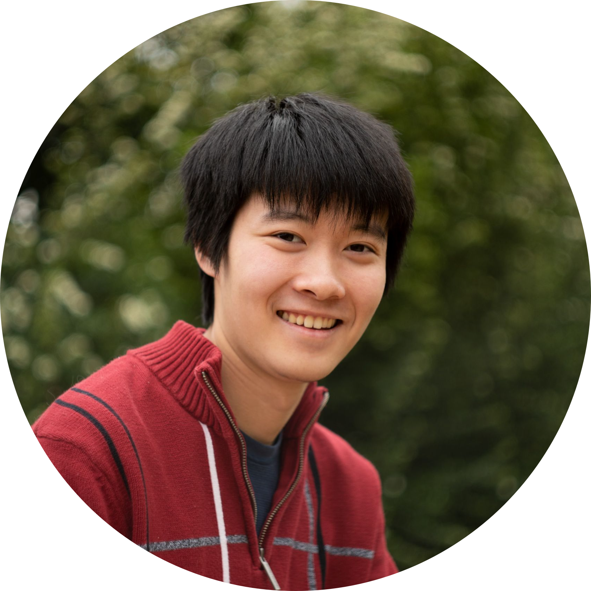

    

 
<h1 style="text-align: center">Who is Spencer?</h1>
 

I am a software engineer with a strong passion
in combining multiple disciplines to make
innovative and effective creations
ranging from autonomous unmanned aerial
systems that gather plant health data to an
ultra cost-effective V-Mount battery 
for cinema cameras.  I will be graduating with
a BS in CS and a minor in Interactive Media
from the University of Southern California in 2024.

 
<h1>Contact</h1>

spencerlin.2002@gmail.com
 
(626) 492 2828
 

